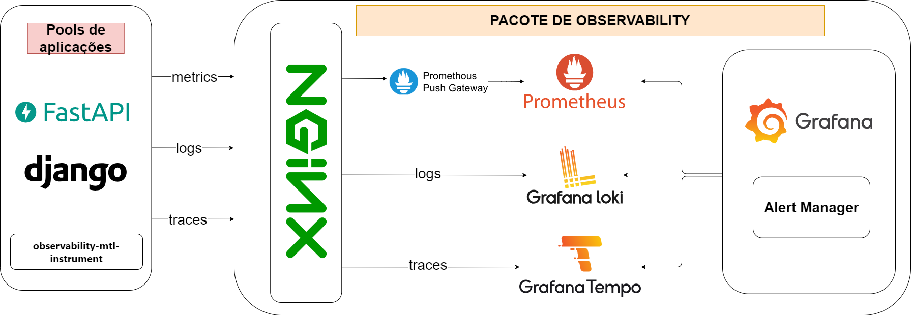

# Observability-mtl-instrument
[](https://observability-mtl-instrument.readthedocs.io/pt-br/latest/?badge=latest)
[](https://github.com/SergioRicJr/observability-mtl-instrument/actions/workflows/pipeline.yaml)
[](https://codecov.io/github/SergioRicJr/observability-mtl-instrument)
[](https://badge.fury.io/py/observability-mtl-instrument)

O observability-mtl-instrument é um pacote que simplifica a instrumentação e configuração para coleta e envio de métricas, traces e logs. Por padrão a Stack utilizada é:
- Métricas: Prometheus e PushGateway
- Traces: Grafana/Tempo
- Logs: Grafana/Loki




# Tabela de conteúdos
* [Pacote de observabilidade](pacote-de-observabilidade)
* [Instalação](instalaçao)
* [Como usar](como-usar)
    - [Métricas](metricas)
    - [Traces](traces)
    - [Logs](logs)
* [Informações adicionais](informaçoes-adicionais)
    - [Métricas](metricas)
    - [Traces](traces)
    - [Logs](logs)
* [Próximas funcionalidades](proximas-funcionalidades)
* [Links](links)


# Pacote de observabilidade
Para simplificar ainda mais o gerenciamento, armazenamento e visualizações de métricas, traces e logs, além de integração com a biblioteca é possível utilizar o pacote de observabilidade, que traz um docker-compose, diversas configurações e exemplos de uso para containers de Prometheus, Grafana/Loki, Grafana/Tempo, Grafana e NGINX. Está disponível em: https://github.com/SergioRicJr/observability-package

# Instalação

Instale e atualize usando pip:

```bash
  pip install observability-mtl-instrument
```

# Como usar

## Métricas
### importação da configuração de métricas:
```py
    from observability_mtl_instrument.metrics.metric_config import MetricConfig
```

### Configuração básica para uso:

```py
    metric_config = MetricConfig(
        job_name='nome escolhido para a aplicação',
        prometheus_url='url do pushGateway para envio de métrica'
    )
```


### Chamada das métricas
As métricas utilizadas são baseadas e utilizam por baixo dos panos o prometheus_client, sendo assim, sejam as métricas padrões ou aquelas criadas por quem está usando, possuem os métodos e as formas de registrar as métricas seguindo a seguinte documentação: https://prometheus.github.io/client_python/. Sendo utilizado em código da seguinte forma:


```py
    metrics = metric_config.metrics

    # As métricas podem ser utilizadas em um middleware da aplicação para funcionar de forma a poluir menos o código 
    metrics['requests_in_progress'].labels(service='fastapi-app').inc()
```

### Envio das métricas
O envio das métricas registradas em código é realizado da seguinte forma:

```py
    metric_config.send_metrics()
```

## Traces
### importação da configuração dos traces:
```py
    from observability_mtl_instrument.tracer.trace_config import TraceConfig
```

### Configuração básica para uso:
```py
    trace_config = TraceConfig(service_name="nome do serviço", tempo_url="http://endereço do tempo/tempo/v1/traces")
```

### Criação de traces no código
Existem duas maneiras de adicionar trace no código, uma delas é com instrumentação automática, que gera os traces a cada chamada de api ou requisição feito durante uma chamada a um endpoint, um exemplo pode ser visto utilizando FastAPIInstrumentor:

```py
    from opentelemetry.instrumentation.fastapi import FastAPIInstrumentor

    trace = trace_config.get_trace()

    FastAPIInstrumentor.instrument_app(app, tracer_provider=trace.get_tracer_provider())
```

A outra forma é realizando a criação manual dos traces:


```py
    tracer = trace_config.get_tracer()

    with tracer.start_as_current_span("name"):
        # Código que fará parte desse trace
```

É possível também adicionar eventos e atributos no centexto do tracer, para conhecer mais acesse https://opentelemetry-python.readthedocs.io/en/latest/api/trace.html

## Logs
### importação da configuração dos logs:
```py
    from observability_mtl_instrument.logs.builders.fullLogConfig import FullLogConfig
```

### Configuração básica para uso:

```py
    log_config = FullLogConfig(
        service_name='nome escolhido para a aplicação',
        loki_url='http://<url-do-loki>/loki/api/v1/push'
    ).get_log_config()
```

obs: A configuração do log_level é feita importando a biblioteca logging e utilizando seus níveis de log, que são:

- logging.DEBUG

- logging.INFO

- logging.WARN

- logging.ERROR

- logging.CRITICAL

por padrão o nível de log é DEBUG.

### Chamada de logs
Os logs são configurados utilizando a biblioteca logging do python, sendo assim, para realizar a chamada e registro dos logs é necessário resgatar o logger em uma variável, como é possível ver na documentação do [logging](https://docs.python.org/3/library/logging.html). Um exemplo de chamada é:

```py
    logger = log_config.get_logger()


    # Essa linha de código é responsável por registrar um log do tipo e realizar seu envio ao Loki
    logger.info('hello message was sent')
```


# Informações adicionais

## Métricas:

### Tipos de métrica
O prometheus possui diversos tipos de métrica, que podem ser conhecidas através de sua documentação, em https://prometheus.io/docs/concepts/metric_types. O projeto observability-mtl-instrument, trabalha com todas elas.

### Métricas default
É possível adicionar e criar métricas de acordo com o seu objetivo, porém, a biblioteca já apresenta três métricas por padrão, são elas:
### http_requests_total_by_code:
Tipo: Counter
<br/>Labels:

| Nome   | Tipo       | Descrição                           |
| :---------- | :--------- | :---------------------------------- |
| `http_code` | `string` | Código do status HTTP. |
| `unmapped` | `boolean` | True ou False, para dizer se a rota é ou não conhecida pela aplicação. |
| `service_name` | `string` | Nome do serviço, aplicação ou job. |

### http_requests_duration_seconds
Tipo: Summary
<br/>Labels: 

| Nome   | Tipo       | Descrição                           |
| :---------- | :--------- | :---------------------------------- |
| `url_path` | `string` | Rota da requisição |
| `http_method` | `string` | Método HTTP usado na requisição |
| `unmapped` | `boolean` | True ou False, para dizer se a rota é ou não conhecida pela aplicação. |
| `service_name` | `string` | Nome do serviço, aplicação ou job. |

### requests_in_progress
Tipo: Gauge
<br/>Labels: 

| Nome   | Tipo       | Descrição                           |
| :---------- | :--------- | :---------------------------------- |
| `service_name` | `string` | Nome do serviço, aplicação ou job. |

### Adição de métricas
Além das métricas já existentes ao realizar a configuração, é possível criar outras completamente personalizadas, adicionando o título, seu tipo, sua descrição e os labels. Segue um exemplo dessa criação de métricas:

```py
    from observability_mtl_instrument.metric_config import MetricType

    # Após instânciar MetricConfig
    metric_config.add_metrics(
        title="requests_in_progress",
        type=MetricType.GAUGE,
        description: "",
        labels=['service']
    )
```

## Logs
### Envio assíncrono de logs
É possível enviar os logs ao container Loki também de forma assíncrona, utilizando a classe FullLogConfigAsync ao invés da FullLogConfig, o que é feito da segunda forma:

```py
    log_config = FullLogConfigAsync(
        service_name='nome escolhido para a aplicação',
        loki_url='http://<url-do-loki>/loki/api/v1/push'
    ).get_log_config()
```

Vale ressaltar que o envio assíncrono de logs é suportado em funções assíncronas, como usadas no fastapi, ou flask, da seguinte forma:

```py
    from fastapi import FastAPI

    app = FastAPI()

    @app.get("/")
    async def welcome():
        logger.info('hello message was sent')
        return {"message": "Hello, welcome to the application!"}
```

Obs: Ainda está sendo estudada a compatibilidade do envio assíncrono com aplicações utilizando o Framework Django.

### Integração com Trace
A configuração padrão dos Logs já realiza a integração com os dados do Trace mas caso seja interessante para o uso escolhido, é possível alterar a formatação do log, alterando o parâmetro log_format ao instânciar o LogConfig:

```py
    log_config = FullLogConfig(
        service_name='nome escolhido para a aplicação',
        loki_url='http://<url-do-loki>/loki/api/v1/push',
        log_format='%(asctime)s levelname=%(levelname)s name=%(name)s file=%(filename)s:%(lineno)d trace_id=%(otelTraceID)s span_id=%(otelSpanID)s resource.service.name=%(otelServiceName)s trace_sampled=%(otelTraceSampled)s - message="%(message)s"',
    ).get_log_config()
```

### Labels
Os labels são utilizados para facilitar a busca por logs no Grafana/Loki, sendo assim, há duas formas possíveis de realizar a adição de labels:

- Na configuração dos logs, onde todos os logs apresentarão esses labels:

```py   
    log_config = FullLogConfig(
        service_name='nome escolhido para a aplicação',
        loki_url='http://<url-do-loki>/loki/api/v1/push',
        extra_labels={
            "label1": "valor1",
            "label2": "valor2"
        }
    ).get_log_config()
```

- Em chamadas específicas de log:

```py
    logger.info('hello message was sent', extra={'extra_labels': {
        "label3": "valor3"
    }})
```


# Próximas funcionalidades
- Desenvolvimento de envio assíncrono de métricas e traces ✏️🚧
- Desenvolvimento de Middleware para Django Rest Framework ✏️🚧
- Desenvolvimento de Middleware para FastAPI ✏️🚧

# Links
- [PyPi releases](https://pypi.org/project/observability-mtl-instrument/)
- [Documentação ReadTheDocs](https://observability-mtl-instrument.readthedocs.io/pt-br/latest/)
- [Código fonte](https://github.com/SergioRicJr/observability-mtl-instrument)
