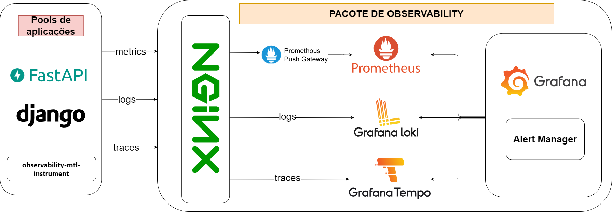

# Observability-mtl-instrument

O observability-mtl-instrument é um pacote que simplifica a instrumentação e configuração para coleta e envio de métricas, traces e logs. Por padrão a Stack utilizada é:
- Métricas: Prometheus e PushGateway
- Traces: Grafana/Tempo
- Logs: Grafana/Loki




# Tabela de conteúdos
* [Pacote de observabilidade](pacote-de-observabilidade)
* [Instalação](instalaçao)
* [Como usar](como-usar)
    - [Métricas](metricas)
    - [Traces](traces)
    - [Logs](logs)
* [Informações adicionais](informaçoes-adicionais)
    - [Métricas](metricas)
    - [Traces](traces)
    - [Logs](logs)
* [Próximas funcionalidades](proximas-funcionalidades)
* [Links](links)


# Pacote de observabilidade
Para simplificar ainda mais o gerenciamento, armazenamento e visualizações de métricas, traces e logs, além de integração com a biblioteca é possível utilizar o pacote de observabilidade, que traz um docker-compose, diversas configurações e exemplos de uso para containers de Prometheus, Grafana/Loki, Grafana/Tempo, Grafana e NGINX. Está disponível em: "ver se posso adicionar link público" 

# Instalação

Instale e atualize usando pip:

```bash
  pip install observability-mtl-instrument
```
    


# Como usar

## Métricas
### importação da configuração de métricas:
```py
    from observability_mtl_instrument.metric_config import MetricConfig
```

### Configuração básica para uso:

```py
    metric_config = MetricConfig(
        job_name='nome escolhido para a aplicação',
        prometheus_url='url do pushGateway para envio de métrica'
    )
```


### Chamar métricas
As métricas utilizadas são baseadas e utilizam por baixo dos panos o prometheus_client, sendo assim, sejam as métricas padrões ou aquelas criadas por quem está usando, possuem os métodos e as formas de registrar as métricas seguindo a seguinte documentação: https://prometheus.github.io/client_python/. Sendo utilizado em código da seguinte forma:


```py
    metrics = metric_config.metrics

    # As métricas podem ser utilizadas em um middleware da aplicação para funcionar de forma a poluir menos o código 
    metrics['requests_in_progress'].labels(service='fastapi-app').inc()
```

### Envio das métricas
O envio das métricas registradas em código é realizado da seguinte forma:

```py
    metric_config.send_metrics()
```


# Informações adicionais

## Métricas:

### Tipos de métrica
O prometheus possui diversos tipos de métrica, que podem ser conhecidas através de sua documentação, em https://prometheus.io/docs/concepts/metric_types. O projeto observability-mtl-instrument, trabalha com todas elas.

### Métricas default
É possível adicionar e criar métricas de acordo com o seu objetivo, porém, a biblioteca já apresenta três métricas por padrão, são elas:
### http_requests_total_by_code:
Tipo: Counter
<br/>Labels:

| Nome   | Tipo       | Descrição                           |
| :---------- | :--------- | :---------------------------------- |
| `http_code` | `string` | Código do status HTTP. |
| `unmapped` | `boolean` | True ou False, para dizer se a rota é ou não conhecida pela aplicação. |
| `service` | `string` | Nome do serviço, aplicação ou job. |

### http_requests_duration_seconds
Tipo: Summary
<br/>Labels: 

| Nome   | Tipo       | Descrição                           |
| :---------- | :--------- | :---------------------------------- |
| `url_path` | `string` | Rota da requisição |
| `http_method` | `string` | Método HTTP usado na requisição |
| `unmapped` | `boolean` | True ou False, para dizer se a rota é ou não conhecida pela aplicação. |
| `service` | `string` | Nome do serviço, aplicação ou job. |

### requests_in_progress
Tipo: Gauge
<br/>Labels: 

| Nome   | Tipo       | Descrição                           |
| :---------- | :--------- | :---------------------------------- |
| `service` | `string` | Nome do serviço, aplicação ou job. |

### Adição de métricas
Além das métricas já existentes ao realizar a configuração, é possível criar outras completamente personalizadas, adicionando o título, seu tipo, sua descrição e os labels. Segue um exemplo dessa criação de métricas:

```py
    from observability_mtl_instrument.metric_config import MetricType

    # Após instânciar MetricConfig
    metric_config.add_metrics(
        title="requests_in_progress",
        type=MetricType.GAUGE,
        description: "",
        labels=['service']
    )
```


# Próximas funcionalidades

- Desenvolvimento de Middleware para Django Rest Framework ✏️🚧
- Desenvolvimento de Middleware para FastAPI ✏️🚧

# Links
- [PyPi releases (pendente)]()
- [Documentação ReadTheDocs](https://observability-mtl-instrument.readthedocs.io/pt-br/latest/)
- [Código fonte](https://github.com/SergioRicJr/observability-mtl-instrument)